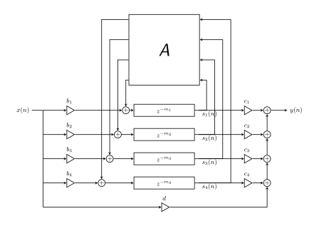
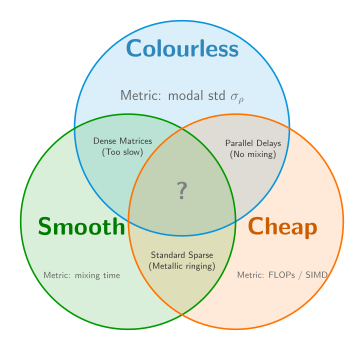

# Structured Pruning of Feedback Delay Networks

A perceptually lossless pruning algorithm for Feedback Delay Networks (FDNs).

## Background

### Feedback Delay Networks
- FDN's are recursive filters used for artificial reverb and decorrelation. 
- Amongst other methods to synthesise reverberation, FDN's are particularly efficient computationally, nonetheless their time complexity is <em>O</em>(<em>N</em>2).

Here's a 4x4 FDN:

As shown, they consist of a set of delays and a feedback matrix through which the delay outputs are coupled to the delay inputs.

### The ideal FDN triad

This thesis formalises a threefold trade-off that's featured on this line of research since its early days.

As shown on the diagram, known structures don't fully satisfy all three requirements simultaneously. This dissertation flips the design approach of FDN's from a "ground-up" to a "top to bottom" perspective:

> What if we start from a differentiable (trained), nice-sounding, dense FDN and try to prune it without losing perceptual/acoustic quality, instead of designing it with the lowest possible N&times;N feedback matrix?

## Benchmark Results

Compiled C++ with ARM NEON intrinsics on Apple M-series, vs Apple Accelerate BLAS. Layer count *L* chosen per-*N* by listening test.

| N | L | LSD (dB) | Staged (ns) | BLAS (ns) | Speedup |
|---|---|---|---|---|---|
| 4 | 8 | 0.00 | 1.5 | 36.2 | 25.0&times; |
| 8 | 6 | 0.90 | 7.1 | 26.7 | 3.8&times; |
| 16 | 4 | 2.46 | 8.8 | 38.4 | 4.4&times; |
| 32 | 10 | 0.11 | 56.2 | 71.3 | 1.3&times; |
| 64 | 3 | 4.25 | 26.2 | 189.6 | 7.2&times; |
| 128 | 3 | 2.24 | 39.2 | 658.4 | 16.8&times; |
| 256 | 3 | 1.50 | 75.8 | 1989.2 | 26.3&times; |

## Impulse Responses

<h3>N = 16, L = 4 4.4&times; faster</h3>

  

    
Dense (trained)

    <audio controls><source src="audio/IR_N16_dense.wav" type="audio/wav"></audio>
  

  

    
Staged (projected)

    <audio controls><source src="audio/IR_N16_L4.wav" type="audio/wav"></audio>
  

<h3>N = 64, L = 3 7.2&times; faster</h3>

  

    
Dense (trained)

    <audio controls><source src="audio/IR_N64_dense.wav" type="audio/wav"></audio>
  

  

    
Staged (projected)

    <audio controls><source src="audio/IR_N64_L3.wav" type="audio/wav"></audio>
  

## Convolved Examples &mdash; N = 16, L = 4 4.4&times;

<h3> Singing</h3>

  

    
Dry

    <audio controls><source src="audio/singing_dry.wav" type="audio/wav"></audio>
  

  

    
Dense (trained)

    <audio controls><source src="audio/singing_N16_dense.wav" type="audio/wav"></audio>
  

  

    
Staged (projected)

    <audio controls><source src="audio/singing_N16_L4.wav" type="audio/wav"></audio>
  

<h3> Drums</h3>

  

    
Dry

    <audio controls><source src="audio/drums_dry.wav" type="audio/wav"></audio>
  

  

    
Dense (trained)

    <audio controls><source src="audio/drums_N16_dense.wav" type="audio/wav"></audio>
  

  

    
Staged (projected)

    <audio controls><source src="audio/drums_N16_L4.wav" type="audio/wav"></audio>
  

<h3> Orchestral</h3>

  

    
Dry

    <audio controls><source src="audio/13_Orchestral_dry.wav" type="audio/wav"></audio>
  

  

    
Dense (trained)

    <audio controls><source src="audio/13_Orchestral_N16_dense.wav" type="audio/wav"></audio>
  

  

    
Staged (projected)

    <audio controls><source src="audio/13_Orchestral_N16_L4.wav" type="audio/wav"></audio>
  

## Convolved Examples &mdash; N = 64, L = 3 7.2&times;

<h3> Singing</h3>

  

    
Dense (trained)

    <audio controls><source src="audio/singing_N64_dense.wav" type="audio/wav"></audio>
  

  

    
Staged (projected)

    <audio controls><source src="audio/singing_N64_L3.wav" type="audio/wav"></audio>
  

<h3> Drums</h3>

  

    
Dense (trained)

    <audio controls><source src="audio/drums_N64_dense.wav" type="audio/wav"></audio>
  

  

    
Staged (projected)

    <audio controls><source src="audio/drums_N64_L3.wav" type="audio/wav"></audio>
  

<h3> Orchestral</h3>

  

    
Dense (trained)

    <audio controls><source src="audio/13_Orchestral_N64_dense.wav" type="audio/wav"></audio>
  

  

    
Staged (projected)

    <audio controls><source src="audio/13_Orchestral_N64_L3.wav" type="audio/wav"></audio>
  

